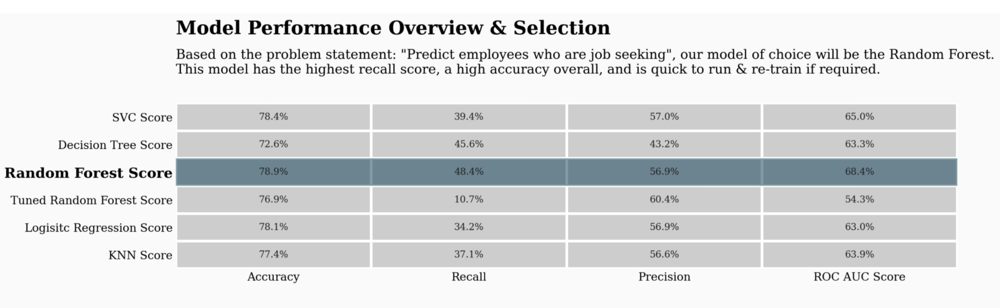

# Predicting job change

## Project definition

This project of predicting employee churn is at the intersection of Human Resources and Machine Learning. In this case, the data provided is obtained from Kaggle dataset repository. According to the dataset description the info come from a company that relies on Big Data and wants to assess job churn after employees complete special training. The information of enrollee/employees is anonymized.

The employee churn/turn-over problem is an adaptation of the customer churn problem, in which a business can predict when one of their customers will stop buying. According to [Col Jung](https://towardsdatascience.com/will-your-employee-leave-a-machine-learning-model-8484c2a6663e), it is well known that it costs more money to hire an employee than to retain them. Thus, an employee that departs from a company take with them valuable experience and knowledge from the organization costing a lot of money to the company.  

Bill Cornely from [Conrerly Consulting](https://www.forbes.com/sites/billconerly/2018/08/12/companies-need-to-know-the-dollar-cost-of-employee-turnover/?sh=6f38a773d590)  estimates that in the United States the cost of an entry-level position turning over at 50 percent of salary, mod-level at 125 percent of salary, and senior executive over 200 percent of salary. For a company that is so specialized in data science and big data, costs must be really high as this type of job description is difficult to recruit because it requires specialized skills and knowhow.

In machine learning, this kind of problem can be seen as a binary classification problem. There are several academic papers (Sisodia, D. S., Vishwakarma, S., & Pujahari, A., 2017; Punnoose, R., & Ajit, P., 2016; Yue Zhao, Maciej K. Hryniewicki, Francesca Cheng, Boyang Fu, & Xiaoyu Zhu., 2018),  that approach employee turn over prediction using classification algorithms such as K-neighrest-heighbors, LSM, Naïve Bayes, Decision Tree, Random Forest, Neural Networks and XGboost.

## Problem statement 

A company that relies on Big Data wants to hire data scientists among candidates that complete special training they provide. At the end of the training enrollees decide if they stay in the company to continue their careers, while others start looking for a new job outside company. This last group costs the company time and money as it invests in the training of the enrollees. 

The company wishes to develop a mechanism to assess the probability that an enrollee will start looking for a new job at the end of the training course. The probabilities will serve as an input to decision making in order to improve the training courses and planning of the HR processes. 

## Datasets and inputs

The training and testing datasets can be obtained from Kaggle from the following links:
- https://www.kaggle.com/arashnic/hr-analytics-job-change-of-data-scientists
- https://www.kaggle.com/arashnic/hr-analytics-job-change-of-data-scientists/tasks?taskId=3015 

The datasets contain information by enrollee.

- Training: 19,158 enrollee
- Testing: 2,129 enrollee

The following features are included:

- `enrollee_id`: Unique ID for candidate
- `city`: City code
- `city_development_index`: Development index of the city (scaled)
- `gender`: Gender of candidate
- `relevent_experience`: Relevant experience of candidate
- `enrolled_university`: Type of University course enrolled if any
- `education_level`: Education level of candidate
- `major_discipline`: Education major discipline of candidate
- `experience`: Candidate total experience in years
- `company_size`: No of employees in current employer's company
- `company_type`: Type of current employer
- `lastnewjob`: Difference in years between previous job and current job
- `training_hours`: training hours completed

The target value for prediction is included in the training and testing set.

- `target`: 0 – Not looking for job change, 1 – Looking for a job change

## Solution statement

- The solution consists on estimating the probabilities of enrollees leaving the company to look for a new job, using a machine learning model. According to the previous research mentioned a gradient boosting tree is a model with a good performance for this type of model. Here we will use the XGboost model implemented in AWS Sagemaker.
- Predictions are expected to be in the form of a batch testing set.

## Benchmark model 

- The best model AUC score will be compared to the following exercise from Joshua Swords , where he uses the same data and calculates de AUC for a wide range of models: SVC, Decision Tree, Random Forest, Logistic Regression and KNN)

## Evaluation metrics 

- The area under the curve metric score is chosen as it is specified in the task, and it is the measure that can be used to establish a comparison with other models that have been fitted for the same purpose.

## Project design outline

1.	**Data acquisition**. Data will be acquired from Kaggle from the sources mentioned above.
2.	**Data quality assessment**. Data will be explored for immediate patterns such as missing data, data types, categories, target variable distribution, etc.
3.	**Data cleaning**. Building on the step before, data will be cleaned including steps such as: missing value imputation and data aggregation.
4.	**Data exploration**. Exploratory analysis will be conducted on the cleaned data, to understand patterns in data that help to understand if variables are good predictors of job churn.
5.	**Modelling**. Models will be fitted to the data in order to estimate the probability of job churn. The data modelling process will include hyperparameter tuning and model comparison. The XGboost models will be trained on a training and validation dataset and tested on new data from a testing dataset. Different optimizations strategies fill be tried such as optimizing for accuracy and AUC score.
6.	**Model evaluation**. The AUC score of models will be evaluated between fitted models and across other models fitted by Joshua Swords to establish a benchmark.
7.	**Conclusion and final output**. A brief discussion of the findings will be presented and a list of enrollees from the testing set with the estimated probabilities will be turned in. 

## References:

- Jung, Col. 2020. Predict Employee Churn with Machine Learning. Towards Data Science. Retrieved from the WWW on the 21 of march from 2021 https://towardsdatascience.com/will-your-employee-leave-a-machine-learning-model-8484c2a6663e. 
- Conerly, Bill (2018). Companies Neet To Know The Dollar Cost Of Employee Turnover. Forbes. Retrieved from the WWW on the 21 of march from 2021 https://www.forbes.com/sites/billconerly/2018/08/12/companies-need-to-know-the-dollar-cost-of-employee-turnover/?sh=6f38a773d590 
- Sisodia, D. S., Vishwakarma, S., & Pujahari, A. (2017). Evaluation of machine learning models for employee churn prediction. https://0-doi-org.biblioteca-ils.tec.mx/DOI: 10.1109/ICICI.2017.8365293.
- Punnoose, R., & Ajit, P. (2016). Prediction of Employee Turnover in Organizations using Machine Learning Algorithms. International Journal of Advanced Research in Artificial Intelligence, 5(9), 22–26. https://0-doi-org.biblioteca-ils.tec.mx/.
- Yue Zhao, Maciej K. Hryniewicki, Francesca Cheng, Boyang Fu, & Xiaoyu Zhu. (2018). Employee Turnover Prediction with Machine Learning: A Reliable Approach. Intelligent Systems and Applications : Proceedings of the 2018 Intelligent Systems Conference (IntelliSys) Volume 2, 737. https://0-doi-org.biblioteca-ils.tec.mx/10.1007/978-3-030-01057-7_56
